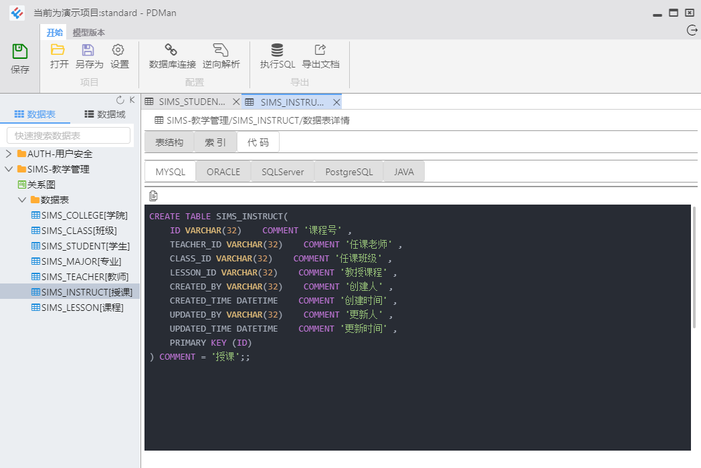

# PDMAN

由于官方版本以多年未更新, 故对其进行了二次开发, 目前的更改为
1. 树结构节点改为单击打开
2. 修改UI布局, 使其更加紧凑
3. 美化界面: 将组件改为AntD, 美化代码样式


开发流程

```bash
$ git clone https://github.com/cweijan/pdman.git
$ cd PDMan
$ npm install                   # 安装项目依赖
$ npm run start                # 编译代码并且启动electron界面
```
预览



未来计划
- 升级关系图, 改用新版本的AntD: https://github.com/lusess123/web-pdm

# 致谢
官方仓库: [pdman](https://gitee.com/robergroup/pdman)
